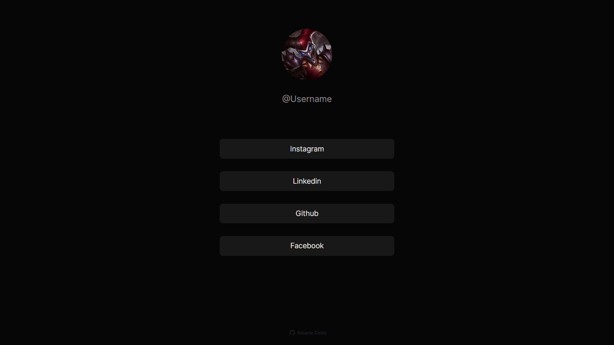

# Connect with me website



## 😎 Watch live

[](https://connect-with-k1ri.netlify.app/)

## 🏠 Run Locally

Clone the project

```bash
  git clone https://github.com/K1riakos/connect-with-me-react
```

Go to the project directory

```bash
  cd connect-with-me-react
```

<br>

## ⚙️ Used


<br>

**👉 Coding**

<br>

**🖥️ Editor**


<br>

**🛠️ Version Control**


<br>

## 🙋🏻‍♂️ Author

**Kyriakos Kiri Sidiropoulos**
